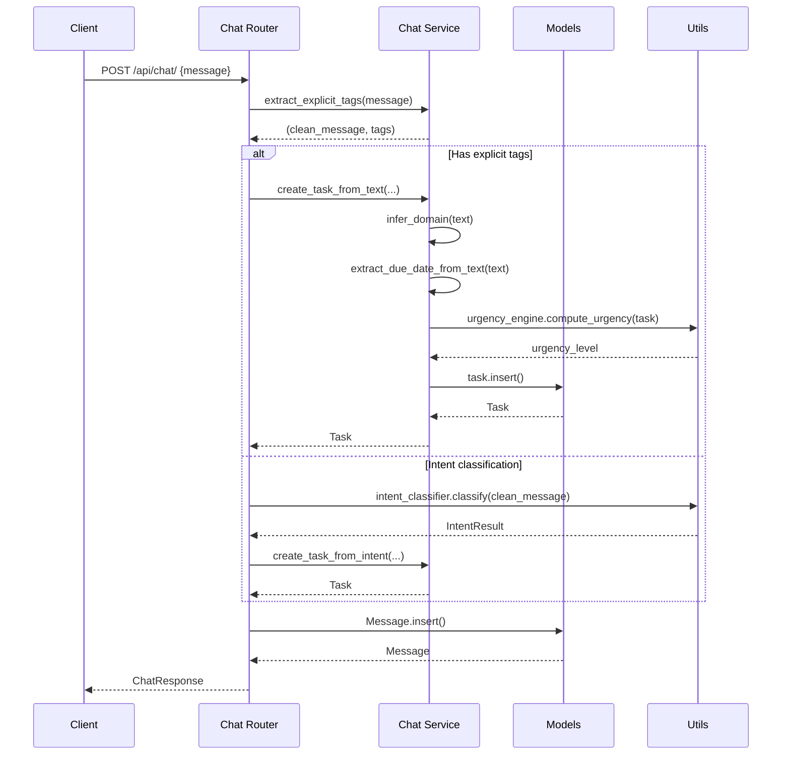

# MVC Refactor Plan for Chat Module

## Overview
Refactor `server/routes/chat.py` to follow MVC pattern by separating business logic into a service layer while keeping the API contract intact.

## Current State Analysis

### chat.py Responsibilities (Mixed)
1. **HTTP Layer (Controller)**: Route handlers, request/response models
2. **Business Logic (Service)**: 
   - `extract_explicit_tags()` - Tag extraction from messages
   - `_create_task_from_text()` - Task creation from text
   - `_create_task_from_intent()` - Task creation from intent
   - `_infer_domain()` - Domain classification
   - `_extract_due_date_from_text()` - Date extraction
   - `_extract_fuzzy_time_from_text()` - Fuzzy time extraction
   - `_task_to_entity()` - Entity conversion
3. **Orchestration**: Intent classification flow, message handling

### Dependencies
- `server.models` - Task, Message, Context, MessageRole, TaskType
- `server.llm` - generate_response
- `server.utils.intent_classifier` - intent_classifier, IntentBucket, ActionType
- `server.utils.urgency` - urgency_engine
- `server.config` - settings
- `server.logger` - Logger

## Target Architecture

```
┌─────────────────────────────────────────────────────────────┐
│                    Controller Layer                          │
│                  server/routes/chat.py                       │
│  - HTTP route handlers                                       │
│  - Request/Response models (ChatRequest, ChatResponse)       │
│  - Call service layer for business logic                     │
└─────────────────────────────────────────────────────────────┘
                              │
                              ▼
┌─────────────────────────────────────────────────────────────┐
│                    Service Layer                             │
│              server/services/chat_service.py                 │
│  - ChatService class with business logic                     │
│  - Task creation methods                                     │
│  - Domain inference                                          │
│  - Date/time extraction                                      │
│  - Entity conversion                                         │
│  - Tag extraction                                            │
└─────────────────────────────────────────────────────────────┘
                              │
                              ▼
┌─────────────────────────────────────────────────────────────┐
│                    Model Layer                               │
│                  server/models.py                            │
│  - Task, Message, Context (Document models)                  │
│  - Enums: TaskType, TaskDomain, MessageRole, etc.            │
│  - Pydantic schemas: TaskCreate, TaskUpdate, etc.            │
└─────────────────────────────────────────────────────────────┘
                              │
                              ▼
┌─────────────────────────────────────────────────────────────┐
│                    Utility Layer                             │
│              server/utils/                                   │
│  - intent_classifier.py - Intent classification              │
│  - urgency.py - Urgency computation                          │
│  - Other utilities                                           │
└─────────────────────────────────────────────────────────────┘
```

## Implementation Plan

### 1. Create Service Layer
**File**: `server/services/chat_service.py`

**Classes and Methods**:
```python
class ChatService:
    """Service layer for chat-related business logic"""
    
    # Tag extraction
    def extract_explicit_tags(self, message: str) -> tuple[str, List[str]]
    
    # Task creation
    async def create_task_from_text(
        self, text: str, message_id: str, action_type: ActionType
    ) -> Optional[Task]
    
    async def create_task_from_intent(
        self, intent_result: IntentResult, message_id: str
    ) -> Optional[Task]
    
    # Domain and classification
    def infer_domain(self, title: str) -> TaskDomain
    
    # Date/time extraction
    def extract_due_date_from_text(self, text: str) -> Optional[datetime]
    def extract_fuzzy_time_from_text(self, text: str) -> Optional[str]
    
    # Entity conversion
    def task_to_entity(self, task: Task, confidence: float) -> dict
    
    # Response generation helpers
    def build_task_created_response(
        self, task: Task, action_type: ActionType
    ) -> str
    
    def build_suggested_action_response(
        self, suggested_action: dict
    ) -> str
```

### 2. Refactor chat.py Routes
**File**: `server/routes/chat.py`

**Changes**:
- Import `ChatService` from services
- Instantiate service at module level
- Replace direct business logic calls with service calls
- Keep route handlers focused on HTTP concerns

**Before**:
```python
@router.post("/")
async def chat(request: ChatRequest):
    # 200+ lines mixing HTTP and business logic
    clean_message, explicit_tags = extract_explicit_tags(request.message)
    # ... business logic ...
    task = await _create_task_from_text(...)
```

**After**:
```python
chat_service = ChatService()

@router.post("/")
async def chat(request: ChatRequest):
    # HTTP concerns only
    clean_message, explicit_tags = chat_service.extract_explicit_tags(request.message)
    # ... orchestration using service ...
    task = await chat_service.create_task_from_text(...)
```

### 3. Create services/__init__.py
**File**: `server/services/__init__.py`

```python
"""Services module for business logic layer"""
from server.services.chat_service import ChatService

__all__ = ["ChatService"]
```

## API Contract Preservation

The following must remain unchanged:

### Request/Response Models
- `ChatRequest` - message, context_id, parent_message_id
- `ChatResponse` - response, message_id, extracted_entities, created_tasks, intent_classification, suggested_action

### Endpoints
- `POST /api/chat/` - Main chat endpoint
- `GET /api/chat/next-action` - Get next action recommendation
- `POST /api/chat/confirm-suggestion` - Confirm suggested action

### Response Format
All response fields must maintain the same structure and types.

## Data Flow



## File Structure After Refactor

```
server/
├── services/
│   ├── __init__.py          # Exports ChatService
│   └── chat_service.py      # Business logic
├── routes/
│   └── chat.py              # HTTP routes only
├── utils/
│   ├── intent_classifier.py # Unchanged
│   └── urgency.py           # Unchanged
└── models.py                # Unchanged
```

## Testing Strategy

1. **Unit Tests for Service Layer**:
   - Test `extract_explicit_tags` with various inputs
   - Test `infer_domain` with different keywords
   - Test date extraction functions
   - Test entity conversion

2. **Integration Tests**:
   - Verify chat endpoint works end-to-end
   - Verify task creation flow
   - Verify intent classification integration

3. **Regression Tests**:
   - Compare responses before/after refactor
   - Ensure identical API contract

## Benefits

1. **Separation of Concerns**: Routes handle HTTP, service handles business logic
2. **Testability**: Service layer can be unit tested independently
3. **Reusability**: Business logic can be reused by other routes/modules
4. **Maintainability**: Clear boundaries make code easier to understand and modify
5. **Scalability**: Easier to extend with new features
